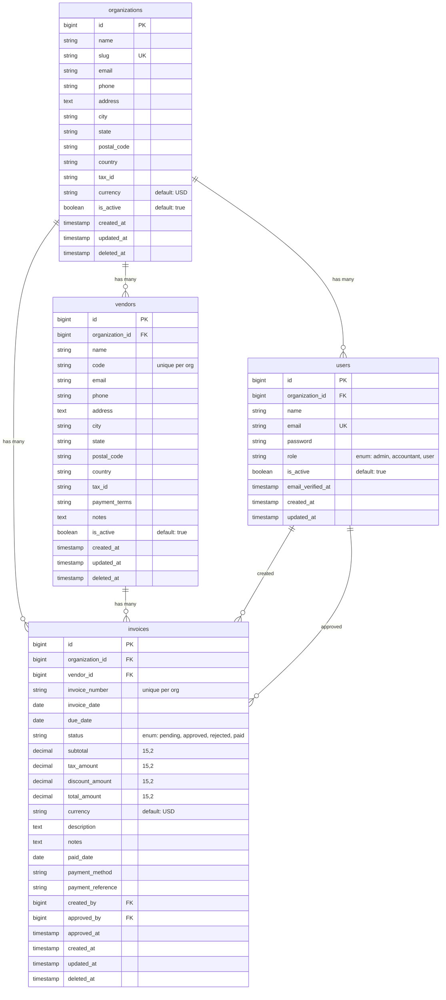

# Entity Relationship Diagram

## ER Diagram (Mermaid)



---

## Table Descriptions

### organizations

The root tenant entity. All other entities belong to an organization for multi-tenant data isolation.

| Column      | Type          | Constraints          | Description                        |
|-------------|---------------|----------------------|------------------------------------|
| id          | BIGINT        | PK, AUTO_INCREMENT   | Primary key                        |
| name        | VARCHAR(255)  | NOT NULL             | Organization name                  |
| slug        | VARCHAR(255)  | UNIQUE, NOT NULL     | URL-friendly identifier            |
| email       | VARCHAR(255)  | NULLABLE             | Contact email                      |
| phone       | VARCHAR(255)  | NULLABLE             | Contact phone                      |
| address     | TEXT          | NULLABLE             | Street address                     |
| city        | VARCHAR(255)  | NULLABLE             | City                               |
| state       | VARCHAR(255)  | NULLABLE             | State/Province                     |
| postal_code | VARCHAR(255)  | NULLABLE             | ZIP/Postal code                    |
| country     | VARCHAR(255)  | NULLABLE             | Country                            |
| tax_id      | VARCHAR(255)  | NULLABLE             | Tax identification number          |
| currency    | VARCHAR(3)    | DEFAULT 'USD'        | Default currency (ISO 4217)        |
| is_active   | BOOLEAN       | DEFAULT true         | Active status flag                 |
| created_at  | TIMESTAMP     | NULLABLE             | Creation timestamp                 |
| updated_at  | TIMESTAMP     | NULLABLE             | Last update timestamp              |
| deleted_at  | TIMESTAMP     | NULLABLE             | Soft delete timestamp              |

---

### users

Team members belonging to an organization with role-based access control.

| Column             | Type          | Constraints          | Description                        |
|--------------------|---------------|----------------------|------------------------------------|
| id                 | BIGINT        | PK, AUTO_INCREMENT   | Primary key                        |
| organization_id    | BIGINT        | FK, NULLABLE         | References organizations.id        |
| name               | VARCHAR(255)  | NOT NULL             | User's full name                   |
| email              | VARCHAR(255)  | UNIQUE, NOT NULL     | Email address (login)              |
| password           | VARCHAR(255)  | NOT NULL             | Hashed password                    |
| role               | VARCHAR(255)  | DEFAULT 'user'       | Role enum: admin, accountant, user |
| is_active          | BOOLEAN       | DEFAULT true         | Active status flag                 |
| email_verified_at  | TIMESTAMP     | NULLABLE             | Email verification timestamp       |
| remember_token     | VARCHAR(100)  | NULLABLE             | Remember me token                  |
| created_at         | TIMESTAMP     | NULLABLE             | Creation timestamp                 |
| updated_at         | TIMESTAMP     | NULLABLE             | Last update timestamp              |

**Indexes:**
- `organization_id` - Foreign key index
- `role` - Role lookup index

---

### vendors

Supplier entities belonging to an organization, used as invoice recipients.

| Column          | Type          | Constraints                    | Description                    |
|-----------------|---------------|--------------------------------|--------------------------------|
| id              | BIGINT        | PK, AUTO_INCREMENT             | Primary key                    |
| organization_id | BIGINT        | FK, NOT NULL                   | References organizations.id    |
| name            | VARCHAR(255)  | NOT NULL                       | Vendor name                    |
| code            | VARCHAR(255)  | NULLABLE                       | Internal vendor code           |
| email           | VARCHAR(255)  | NULLABLE                       | Contact email                  |
| phone           | VARCHAR(255)  | NULLABLE                       | Contact phone                  |
| address         | TEXT          | NULLABLE                       | Street address                 |
| city            | VARCHAR(255)  | NULLABLE                       | City                           |
| state           | VARCHAR(255)  | NULLABLE                       | State/Province                 |
| postal_code     | VARCHAR(255)  | NULLABLE                       | ZIP/Postal code                |
| country         | VARCHAR(255)  | NULLABLE                       | Country                        |
| tax_id          | VARCHAR(255)  | NULLABLE                       | Tax identification number      |
| payment_terms   | VARCHAR(255)  | NULLABLE                       | Payment terms (days)           |
| notes           | TEXT          | NULLABLE                       | Internal notes                 |
| is_active       | BOOLEAN       | DEFAULT true                   | Active status flag             |
| created_at      | TIMESTAMP     | NULLABLE                       | Creation timestamp             |
| updated_at      | TIMESTAMP     | NULLABLE                       | Last update timestamp          |
| deleted_at      | TIMESTAMP     | NULLABLE                       | Soft delete timestamp          |

**Indexes:**
- `organization_id` - Foreign key index
- `(organization_id, code)` - Unique composite index

---

### invoices

Financial records for vendor payments with status workflow.

| Column            | Type           | Constraints                    | Description                      |
|-------------------|----------------|--------------------------------|----------------------------------|
| id                | BIGINT         | PK, AUTO_INCREMENT             | Primary key                      |
| organization_id   | BIGINT         | FK, NOT NULL                   | References organizations.id      |
| vendor_id         | BIGINT         | FK, NOT NULL                   | References vendors.id            |
| invoice_number    | VARCHAR(255)   | NOT NULL                       | Invoice number (unique per org)  |
| invoice_date      | DATE           | NOT NULL                       | Invoice issue date               |
| due_date          | DATE           | NULLABLE                       | Payment due date                 |
| status            | VARCHAR(255)   | DEFAULT 'pending'              | Status enum (see below)          |
| subtotal          | DECIMAL(15,2)  | DEFAULT 0                      | Subtotal before tax/discount     |
| tax_amount        | DECIMAL(15,2)  | DEFAULT 0                      | Tax amount                       |
| discount_amount   | DECIMAL(15,2)  | DEFAULT 0                      | Discount amount                  |
| total_amount      | DECIMAL(15,2)  | DEFAULT 0                      | Total = subtotal + tax - discount|
| currency          | VARCHAR(3)     | DEFAULT 'USD'                  | Currency code (ISO 4217)         |
| description       | TEXT           | NULLABLE                       | Invoice description              |
| notes             | TEXT           | NULLABLE                       | Internal notes                   |
| paid_date         | DATE           | NULLABLE                       | Actual payment date              |
| payment_method    | VARCHAR(255)   | NULLABLE                       | Payment method used              |
| payment_reference | VARCHAR(255)   | NULLABLE                       | Payment transaction reference    |
| created_by        | BIGINT         | FK, NULLABLE                   | References users.id (creator)    |
| approved_by       | BIGINT         | FK, NULLABLE                   | References users.id (approver)   |
| approved_at       | TIMESTAMP      | NULLABLE                       | Approval timestamp               |
| created_at        | TIMESTAMP      | NULLABLE                       | Creation timestamp               |
| updated_at        | TIMESTAMP      | NULLABLE                       | Last update timestamp            |
| deleted_at        | TIMESTAMP      | NULLABLE                       | Soft delete timestamp            |

**Indexes:**
- `organization_id` - Foreign key index
- `vendor_id` - Foreign key index
- `status` - Status lookup index
- `invoice_date` - Date range queries
- `(organization_id, invoice_number)` - Unique composite index

---

## Relationship Summary

### One-to-Many Relationships

| Parent Entity | Child Entity | Foreign Key      | On Delete |
|--------------|--------------|------------------|-----------|
| organizations | users        | organization_id  | SET NULL  |
| organizations | vendors      | organization_id  | CASCADE   |
| organizations | invoices     | organization_id  | CASCADE   |
| vendors       | invoices     | vendor_id        | CASCADE   |
| users         | invoices     | created_by       | SET NULL  |
| users         | invoices     | approved_by      | SET NULL  |

### Cardinality

```
Organization (1) ──────< (N) User
Organization (1) ──────< (N) Vendor
Organization (1) ──────< (N) Invoice
Vendor (1) ────────────< (N) Invoice
User (1) ──────────────< (N) Invoice (as creator)
User (1) ──────────────< (N) Invoice (as approver)
```

---

## Enum Values

### UserRole

| Value      | Label      | Permissions                        |
|------------|------------|-------------------------------------|
| admin      | Admin      | canWrite, canApprove, canManageUsers|
| accountant | Accountant | canWrite                           |
| user       | User       | View only                          |

### InvoiceStatus

| Value    | Label    | Color   | Can Edit | Can Delete | Next Statuses       |
|----------|----------|---------|----------|------------|---------------------|
| pending  | Pending  | warning | Yes      | Yes        | approved, rejected  |
| approved | Approved | success | No       | No         | paid, rejected      |
| rejected | Rejected | danger  | Yes      | Yes        | pending             |
| paid     | Paid     | info    | No       | No         | (none - terminal)   |

---

## Multi-Tenancy Design

All primary data tables include `organization_id` as a foreign key to enforce tenant isolation:

```
┌─────────────────────────────────────────────┐
│              Organization A                  │
├─────────────────────────────────────────────┤
│ Users A1, A2, A3                            │
│ Vendors VA1, VA2                            │
│ Invoices IA1, IA2, IA3                      │
└─────────────────────────────────────────────┘

┌─────────────────────────────────────────────┐
│              Organization B                  │
├─────────────────────────────────────────────┤
│ Users B1, B2                                │
│ Vendors VB1, VB2, VB3                       │
│ Invoices IB1, IB2                           │
└─────────────────────────────────────────────┘
```

- Users can only access data within their organization
- `BelongsToOrganization` trait automatically scopes all queries
- `TenantMiddleware` enforces organization context on all requests
